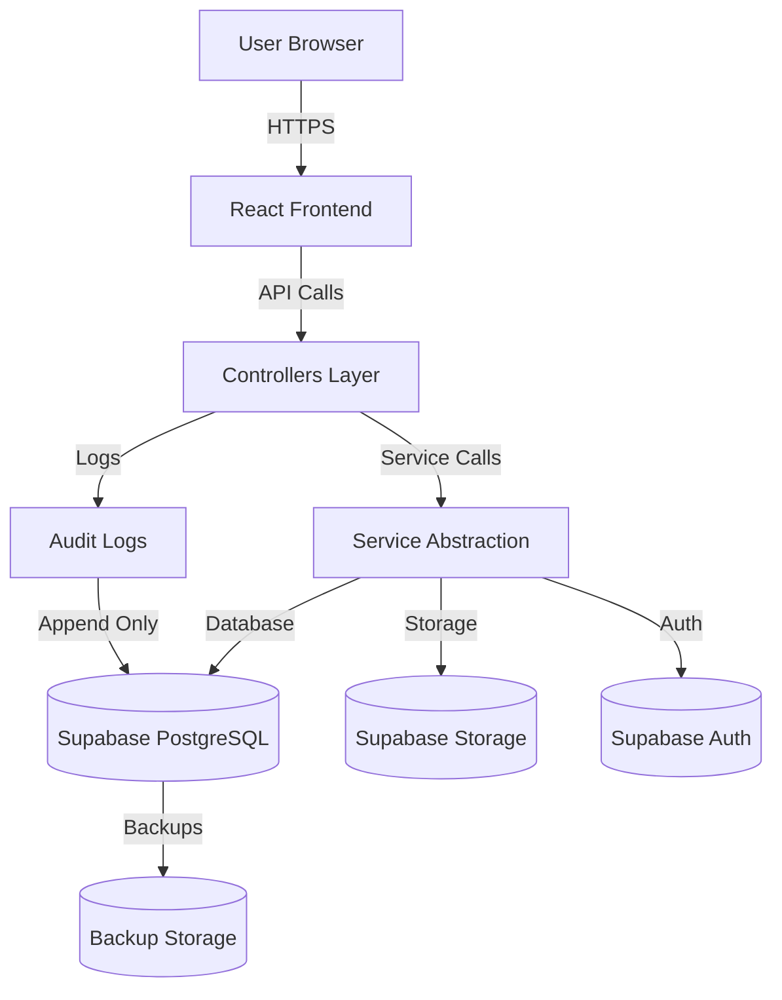

# Data Flow Diagram

## Overview

This document describes how personal data flows through the Case Chronicles application, required for GDPR compliance and ISO 27001 documentation.

---

## System Architecture



---

## Personal Data Flow

### 1. User Registration

```
User Input (Email, Password, Name)
    ↓
Frontend (React Component)
    ↓
authController.signup()
    ↓
authService.signUp() [Service Abstraction]
    ↓
Supabase Auth
    ↓
Supabase Database (profiles table)
    ↓
Audit Log: 'login' action
```

**Personal Data Collected:**
- Email address
- Password (hashed)
- First name
- Last name
- User ID (UUID)

**Storage Location:**
- `auth.users` table (Supabase Auth)
- `profiles` table (Supabase Database)

---

### 2. Case Creation

```
User Input (Case Title, Client, Status)
    ↓
Frontend (NewCaseModal)
    ↓
caseController.createNewCase()
    ↓
Authorization Check (requireAuth)
    ↓
caseModel.createCase()
    ↓
databaseService.insert() [Service Abstraction]
    ↓
Supabase Database (cases table)
    ↓
Audit Log: 'data_create' action
```

**Personal Data Collected:**
- Case title (may contain client names)
- Client name
- User ID (owner)

**Storage Location:**
- `cases` table (Supabase Database)

---

### 3. Email Processing

```
User Input (Email Content, Attachments)
    ↓
Frontend (NewEmailModal)
    ↓
emailController.createNewEmail()
    ↓
Authorization Check (requireAuth)
    ↓
emailModel.createEmail()
    ↓
databaseService.insert() [Service Abstraction]
    ↓
Supabase Database (emails table)
    ↓
storageService.upload() [Service Abstraction]
    ↓
Supabase Storage (email_attachments bucket)
    ↓
Audit Log: 'file_upload' + 'data_create'
```

**Personal Data Collected:**
- Email subject
- Email body (may contain PII)
- Email attachments (may contain PII)
- Sender/recipient information
- User ID (owner)

**Storage Location:**
- `emails` table (Supabase Database)
- `email_attachments` bucket (Supabase Storage)

---

### 4. Document Upload

```
User Input (File)
    ↓
Frontend (AttachDocumentButton)
    ↓
documentController.uploadDocumentToCase()
    ↓
Authorization Check (requireAuth)
    ↓
documentModel.uploadDocument()
    ↓
storageService.upload() [Service Abstraction]
    ↓
Supabase Storage (case_document bucket)
    ↓
Audit Log: 'file_upload' action
```

**Personal Data Collected:**
- File content (may contain PII)
- Filename
- File metadata
- User ID (owner)

**Storage Location:**
- `case_document` bucket (Supabase Storage)

---

### 5. Data Export (GDPR Art. 20)

```
User Request (Export My Data)
    ↓
Frontend (Settings Page)
    ↓
dataController.exportUserData()
    ↓
Authorization Check (requireAuth, requireOwnership)
    ↓
Aggregate Data from All Tables
    ↓
Generate JSON/CSV Export
    ↓
Audit Log: 'data_export' action
    ↓
Return to User
```

**Personal Data Exported:**
- All user profile data
- All cases owned by user
- All emails owned by user
- All events owned by user
- All contacts owned by user
- All documents owned by user

**Storage Location:**
- Temporary (generated on-demand)
- Not stored permanently

---

### 6. Data Deletion (GDPR Art. 17)

```
User Request (Delete My Account)
    ↓
Frontend (Settings Page)
    ↓
dataController.deleteUserData()
    ↓
Authorization Check (requireAuth, requireOwnership)
    ↓
Soft Delete: Mark as deleted
    OR
Hard Delete: Remove all data
    ↓
Delete from All Tables
    ↓
Delete from Storage Buckets
    ↓
Audit Log: 'data_deletion' action
```

**Personal Data Deleted:**
- User profile
- All cases
- All emails
- All events
- All contacts
- All documents
- All storage files

**Storage Location:**
- Soft delete: Data marked as deleted, retained for recovery
- Hard delete: Data permanently removed

---

## Data Processing Locations

### Primary Storage (Supabase)

**Location:** Supabase Cloud (EU/US - configurable)

**Data Stored:**
- User authentication data
- User profiles
- Cases
- Emails
- Events
- Contacts
- Documents metadata
- Audit logs

**Access:**
- Application (via service abstraction)
- Supabase Dashboard (admin only)
- Database backups

### File Storage (Supabase Storage)

**Location:** Supabase Storage (EU/US - configurable)

**Data Stored:**
- Email attachments
- Case documents

**Access:**
- Application (via service abstraction)
- Supabase Dashboard (admin only)
- Storage backups

### Third-Party Services

**Supabase:**
- Data Processor (GDPR)
- DPA required
- EU data residency available

**No other third-party services** currently process personal data.

---

## Data Access Matrix

| Role | Database Access | Storage Access | Audit Logs | Admin Panel |
|------|----------------|----------------|------------|-------------|
| **End User** | Own data only (via RLS) | Own files only | Own logs only | No |
| **Application** | All data (via service role) | All files (via service role) | Read-only | No |
| **Admin** | All data (via Supabase Dashboard) | All files (via Supabase Dashboard) | All logs | Yes |
| **System** | Audit logs only | None | Write-only | No |

---

## Data Retention

### Active Data
- **Retention:** Indefinite (while user account active)
- **Location:** Supabase Database & Storage
- **Access:** User + Application

### Deleted Data (Soft Delete)
- **Retention:** 30 days (recovery period)
- **Location:** Supabase Database (marked as deleted)
- **Access:** Admin only

### Audit Logs
- **Retention:** 7 years (compliance requirement)
- **Location:** Supabase Database (audit_logs table)
- **Access:** Admin only (read-only for users)

### Backups
- **Retention:** 90 days
- **Location:** Supabase Backup Storage
- **Access:** Admin only

---

## Data Transfers

### Internal Transfers
- Frontend → Backend: HTTPS encrypted
- Backend → Supabase: TLS encrypted
- No unencrypted transfers

### External Transfers
- **None currently** - All data stays within Supabase infrastructure
- Future: Data export (GDPR Art. 20) - User-initiated, encrypted download

---

## Security Measures

### Encryption
- **In Transit:** TLS 1.2+ (HTTPS)
- **At Rest:** Supabase managed encryption
- **Database:** AES-256 encryption
- **Storage:** AES-256 encryption

### Access Control
- **Authentication:** Supabase Auth (JWT tokens)
- **Authorization:** Application-level (controllers)
- **Database:** Row Level Security (RLS)
- **Storage:** Bucket policies

### Monitoring
- **Audit Logging:** All sensitive operations
- **Error Logging:** Centralized error tracking
- **Access Logging:** Authentication events

---

## Data Subject Rights (GDPR)

### Right to Access (Art. 15)
- **Implementation:** Data export endpoint
- **Process:** User requests → Controller → Aggregate data → Return JSON/CSV

### Right to Rectification (Art. 16)
- **Implementation:** Update endpoints in controllers
- **Process:** User updates → Controller → Model → Database

### Right to Erasure (Art. 17)
- **Implementation:** Delete endpoints in controllers
- **Process:** User requests → Controller → Soft/Hard delete → Audit log

### Right to Data Portability (Art. 20)
- **Implementation:** Export endpoint
- **Process:** User requests → Controller → Generate export → Return file

### Right to Object (Art. 21)
- **Implementation:** User can delete account
- **Process:** Same as Right to Erasure

---

## Compliance Notes

### GDPR
- ✅ Data minimization implemented
- ✅ Purpose limitation enforced
- ✅ Storage limitation (retention policies)
- ✅ Data subject rights supported
- ✅ Audit logging in place
- ⚠️ DPA with Supabase required
- ⚠️ Privacy policy required

### ISO 27001
- ✅ Access control implemented
- ✅ Audit logging implemented
- ✅ Encryption in transit and at rest
- ✅ Backup and recovery procedures
- ⚠️ Security policies documented
- ⚠️ Incident response plan required

---

**Last Updated:** January 26, 2026  
**Next Review:** Quarterly
